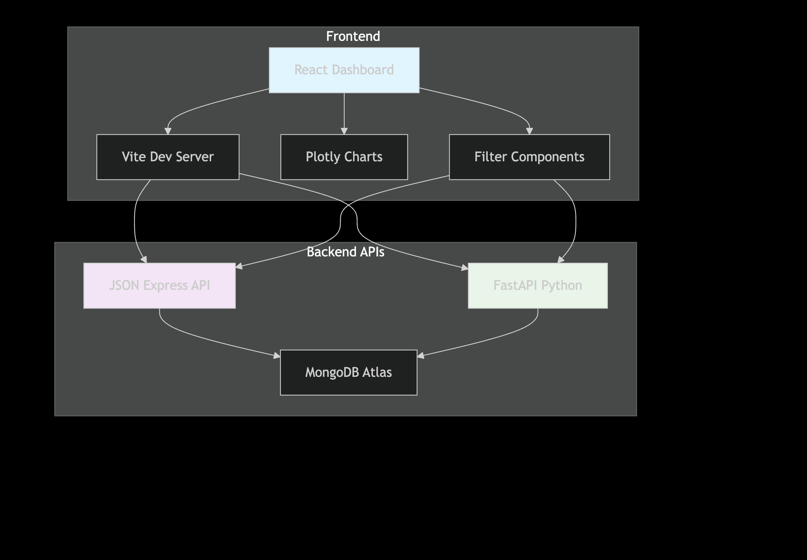
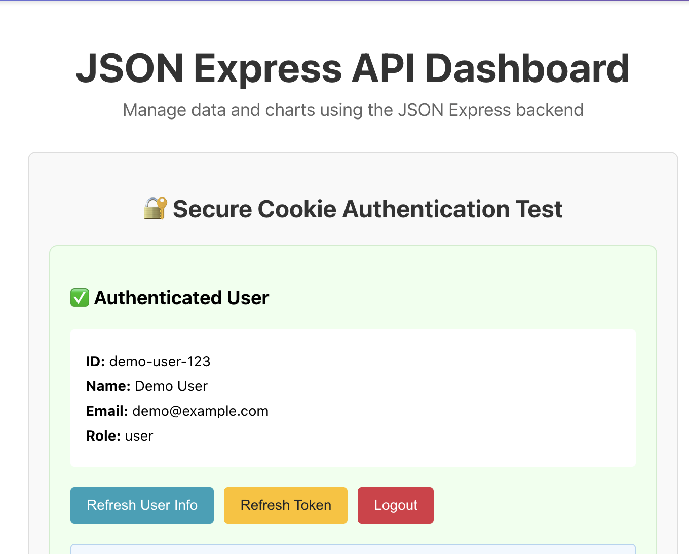
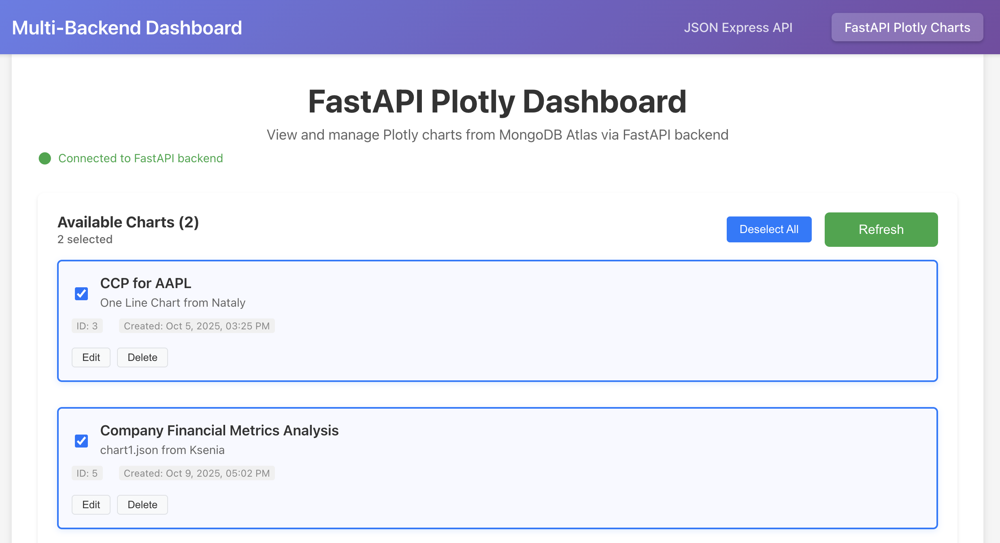
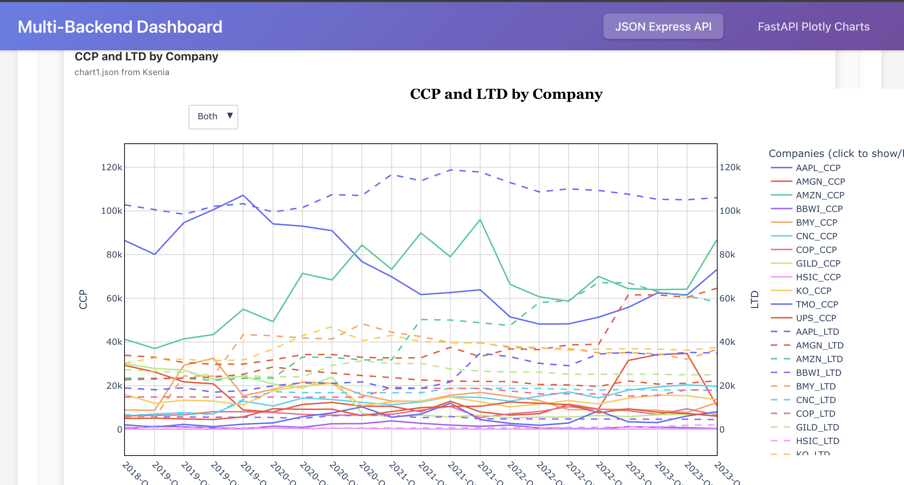

# Multi-Backend Plotly Dashboard

A React application that displays interactive Plotly charts stored in MongoDB Atlas, connecting to two different backend APIs (Express.js & FastAPI) with dynamic filtering capabilities.

🚀 Vite Migration Complete!
⚠️ Important Update: This project has been successfully migrated from Create React App (CRA) to Vite for better performance and modern tooling.

Original CRA version: Available on fastAPI branch
Current Vite version: On vite-migration branch

Why We Migrated to Vite

Create React App was officially deprecated and is no longer maintained. Besides, Vite offers:

⚡ Lightning-fast development server (222ms startup vs several seconds). It makes coding a lot faster
🔥 Instant hot module replacement (HMR)
📦 Optimized production builds with better tree-shaking
🎯 Native ES modules support
🛠️ Modern tooling that's actively maintained



## 📚 Documentation

- **[SECURITY.md](./SECURITY.md)** - Security features, authentication, CSRF protection
- **[CSRF_IMPLEMENTATION.md](./CSRF_IMPLEMENTATION.md)** - Detailed CSRF protection guide  
- **[ARCHITECTURE.md](./ARCHITECTURE.md)** - System architecture, data flow, filtering
- **[DEVELOPMENT.md](./DEVELOPMENT.md)** - Development notes, troubleshooting, AI coding tips

---

## 🚀 Quick Start

### Prerequisites
- Node.js 16+
- MongoDB Atlas connection
- Backend APIs running (JSON Express & FastAPI)

### Installation

```bash
# Clone and navigate
git clone <repository-url>
cd load-json-data

# Install dependencies
npm install

# Configure environment
cp .env.example .env
# Edit .env with your API URLs

# Start development server
npm run dev
```
### Remember to Check MongoDB Atlas connection is running and includes your current IP address!!!

### Available Commands

```bash
npm run dev      # Start Vite dev server
npm run build    # Build for production
npm run preview  # Preview production build
npm run test     # Run tests with Vitest
```

---

## 🎯 What Does This App Do?

This dashboard fetches and displays Plotly JSON chart data from MongoDB Atlas without modifying the original database. You can:

- **View charts** from two different backend systems
• ChartSelector shows list of available charts
• User clicks a chart
• PlotlyChartViewer renders the Plotly chart
- **Filter data** by date ranges, companies, and metrics (client-side)
• User adjusts date range, company, or metrics; still needs
refinements
• Filters run in the browser (not in database)
• Chart updates instantly
- **Preserve data integrity** - all filtering happens in memory, never touching the database

### Backend Integration

**JSON Express API** (`http://localhost:3001/api`)
- Legacy system with basic REST API
- Simple, fast data retrieval

**FastAPI** (`http://localhost:8000`)
- Modern Python backend
- Better error handling and validation

Both APIs feed the same React components - that's the power of modular architecture!

---

## 📁 Project Structure

```
src/
├── services/           # API communication layer
│   ├── api.js          # Express.js API client
│   ├── fastApiService.js  # FastAPI client
│   └── authService.js  # Authentication service
│
├── hooks/              # Custom React hooks for data management
│   ├── useChartData.js    # JSON Express data
│   └── useFastAPICharts.js # FastAPI data
│
├── components/         # Reusable UI components
│   ├── fastapi/
│   │   ├── PlotlyChartViewer.js
│   │   └── ChartList.js
│   ├── ChartSelector.js
│   ├── ErrorDisplay.js
│   └── Loading.js
│
├── pages/              # Page-level components
│   ├── JSONExpressPage.js
│   └── FastAPIPage.js
│
└── utils/              # Utility functions
    ├── envValidation.js
    └── csrfToken.js
```

**Key Principles:**
- **Services** handle all network requests
- **Hooks** manage state and data fetching
- **Components** focus purely on UI
- **Pages** compose everything together

See [ARCHITECTURE.md](./ARCHITECTURE.md) for detailed explanations.

---

## 🌍 Environment Configuration

### Vite Environment Variables

Create `.env.development` for local development:

```bash
VITE_API_BASE_URL=http://localhost:3001/api
VITE_FASTAPI_URL=http://localhost:8000
VITE_ENVIRONMENT=development
VITE_APP_NAME=Financial Data Tracker
```

For production, create `.env.production`:

```bash
VITE_API_BASE_URL=https://your-api-domain.com/api
VITE_FASTAPI_URL=https://your-fastapi-domain.com
VITE_ENVIRONMENT=production
VITE_APP_NAME=Financial Data Tracker
```

⚠️ **Important**: MongoDB connection strings are stored in your **backend** `.env` files, not in this React app. The React app only knows about API endpoints.

---

## 📸 Screenshots

### Login Screen


### Dashboard Overview


### Chart Display


---

## 🔒 Security Highlights

- ✅ **httpOnly Cookies** - Session tokens never accessible to JavaScript
- ✅ **CSRF Protection** - Double-submit cookie pattern (see [CSRF_IMPLEMENTATION.md](./CSRF_IMPLEMENTATION.md))
- ✅ **Secure Architecture** - Database credentials never exposed to frontend
- ✅ **Environment Validation** - Runtime checks for required configuration
- ✅ **HTTPS Enforcement** - Production builds validate secure connections

See [SECURITY.md](./SECURITY.md) for complete security documentation.

---

## 🛠️ Development

### Backend Setup

**Start JSON Express API:**
```bash
cd /path/to/json-express-api
npm run dev
or
node app.js
```

**Start FastAPI:**
```bash
cd /path/to/fastAPI-backend
python3 run.py
```

### Common Issues

| Issue | Solution |
|-------|----------|
| "Network Error" | Ensure backend APIs are running |
| CORS errors | Check backend CORS configuration allows `localhost:5173` |
| Missing charts | Verify MongoDB Atlas connection in backend |
| Auth failures | Check backend authentication endpoints |

See [DEVELOPMENT.md](./DEVELOPMENT.md) for detailed troubleshooting.

---

## 🚀 Deployment

### Pre-Production Checklist

- [ ] Create `.env.production` with production API URLs
- [ ] Deploy backend APIs (Heroku, AWS, Railway, etc.)
- [ ] Update MongoDB connection strings in backend `.env` files
- [ ] Test production build locally: `npm run build && npm run preview`
- [ ] Deploy React app (Vercel, Netlify, etc.)
- [ ] Verify HTTPS is enforced
- [ ] Test CSRF protection
- [ ] Monitor application logs

---

## 🎯 Why This Architecture?

### Modular Design Benefits

1. **Easy to Understand** - Each file has one job
2. **Easy to Change** - Modify one part without breaking others
3. **Easy to Test** - Test components independently
4. **Reusable** - Same components work for both APIs

### Why Two Backends?

- **JSON Express** - Demonstrates legacy system integration
- **FastAPI** - Shows modern backend with better validation
- **Flexibility** - Same frontend works with different backend technologies

---

## 📋 Tech Stack

**Frontend:**
- React 19
- Vite (build tool)
- Plotly.js (charts)
- Axios (HTTP client)
- Vitest (testing)

**Backend (separate repositories):**
- Express.js + MongoDB (JSON Express API)
- FastAPI + MongoDB (FastAPI backend)

**Security:**
- httpOnly cookies
- CSRF protection
- Environment validation

---

## 🤝 Contributing

This is a personal learning project demonstrating:
- Multi-backend integration
- Secure authentication patterns
- Modular React architecture
- AI-assisted development

See [DEVELOPMENT.md](./DEVELOPMENT.md) for notes on AI-assisted coding practices.

---

## 📝 License

MIT License - feel free to use this project as a learning resource.

---

## 🙋 Questions?

- Check the inline code comments - each module is documented
- Review the detailed documentation files linked above
- Use AI assistants like Windsurf, Warp, or Cursor for code explanations

**The modular structure guides you to the right file!**
